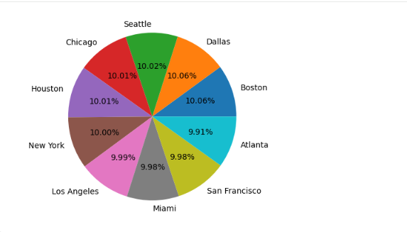
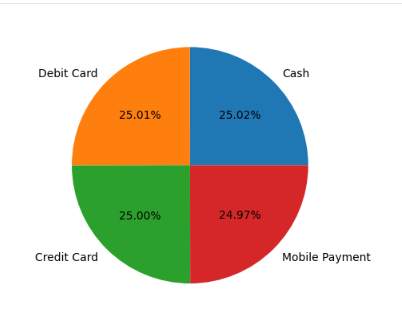
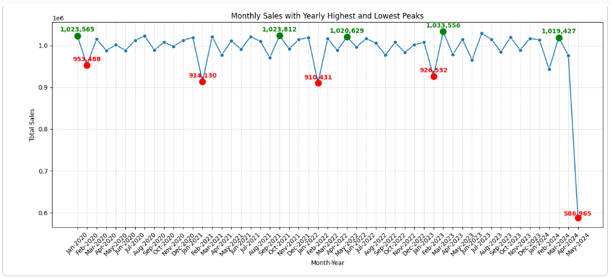
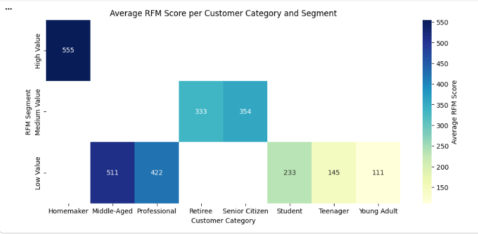

# 🛒 Retail Transactions Data Analysis

## 📌 Project Overview
This project focuses on performing **Exploratory Data Analysis (EDA)** and **customer behavior analysis** on a retail transactions dataset. The objective is to practice data analysis techniques, uncover patterns, and derive insights related to sales, customer segments, discounts, and purchasing behavior.

⚠️ **Important Note:**  
This dataset is **synthetic**, generated using the **Python Faker library**, and is intended **only for practice and learning purposes**. Therefore, some real-world retail behaviors (such as seasonal spikes, promotion-driven demand, or strong product associations) may not be accurately reflected.

---

## 📂 Dataset Information
- **Source:** Kaggle  
- **Dataset Name:** Retail Transactions Dataset  
- **Type:** Synthetic (Programmatically generated)

### Dataset Characteristics
- **Total Records:** ~1,000,000 transactions  
- **Total Columns:** 13  
- **Customer Categories:** 8  
  - Homemaker, Professional, Young Adult, Retiree, Student, Middle-Aged, Senior Citizen, Teenager  
- **Cities Covered:** 10 (All from the United States)  
- **Store Types:** 8  
- **Payment Methods:** 4 (Cash, Credit Card, Debit Card, Mobile Payment)  
- **Price Range per Item:** $5 – $100  

---

## 🔍 Assumptions Made
- The dataset is **synthetic**, so insights should **not be interpreted as real business decisions**.
- `Transaction_ID` is only a unique identifier and **does not indicate transaction sequence**.
- The `Date` column is the **only reliable source for time-based analysis**.
- The `Product` column contains the actual list of purchased items; derived fields such as `Total_Items` were recalculated where needed.

---

## 📊 Analysis Performed

### 1️⃣ Descriptive & Exploratory Data Analysis (EDA)
- Distribution of transactions across cities, payment methods, store types, and customer categories
- Sales trends over time (monthly & yearly)
- Discount and promotion behavior analysis

### City-wise Transaction Distribution

### Payment Methods Preference Distribution

📌 **Key Finding:**  
Dallas and Boston have slightly higher transaction counts (~10.06%). Most variables including payment methods show **uniform distributions**, which is expected due to the synthetic nature of the dataset.

---

### 2️⃣ Sales Analysis
- Monthly and yearly sales trends
- Identification of peak and low-performing months
- Seasonal pattern evaluation

### Monthly Sales Trend

📌 **Insight:**  
While peak sales months vary each year, lower sales are often observed in February (fewer days) and May 2024 (partial-year data).

---

### 3️⃣ RFM Analysis (Category-Level)
Due to the absence of a unique customer identifier, **RFM analysis was performed at the customer category level**:
- **Recency:** Most recent transaction date per category
- **Frequency:** Total number of transactions
- **Monetary:** Total revenue generated

### RFM Segmentation Heatmap

📌 **Key Insight:**  
- Homemakers emerge as **high-value customers**
- Middle-Aged and Professional segments may benefit from targeted engagement strategies

---

### 4️⃣ Market Basket Analysis (Apriori)
- Transactions were filtered to include only those with **2 or more items**
- One-hot encoding applied using Transaction Encoder
- Apriori algorithm used to find frequent itemsets

📌 **Key Finding:**  
Although ~80% of transactions contain multiple items, **specific item combinations occur very rarely**, making the dataset **sparse at the itemset level**. As a result, no meaningful association rules could be generated using standard support thresholds.

---

## 📌 Final Conclusion
This project demonstrates that while the dataset is **dense in transaction size**, it is **sparse in repeated item combinations**, limiting Market Basket Analysis outcomes.  
The uniformity observed across multiple variables confirms the **synthetic nature of the data**.

Despite these limitations, the dataset serves as an excellent resource for:
- Practicing EDA
- Learning feature engineering
- Implementing RFM analysis
- Understanding the challenges of Market Basket Analysis on large datasets

---

## 🛠️ Tools & Technologies Used
- Python
- Pandas, NumPy
- Matplotlib, Seaborn
- MLxtend (Apriori & Association Rules)
- Google Colab

---

## 🔗 Google Colab Notebook

You can also view and run this project on Google Colab:  
👉 [Open in Google Colab](https://colab.research.google.com/drive/1A3IqiZQy6XG9mcP-RSGwMykIQYqqbaN2?usp=sharing)

---

## 📎 Disclaimer
This project is created **solely for educational and practice purposes**.  
Insights derived from this analysis should **not be treated as real-world retail business insights**.

---

## 👩‍💻 Author
**Sadia Moeed**  
Data Analytics & Software Engineering Enthusiast
