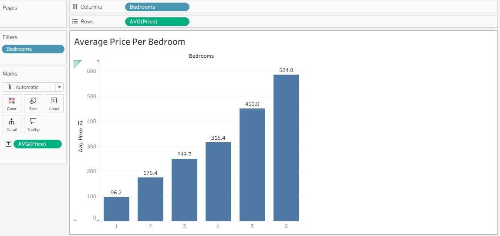
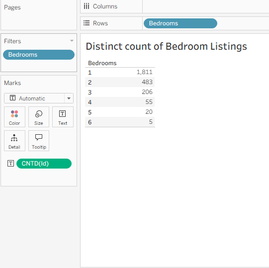
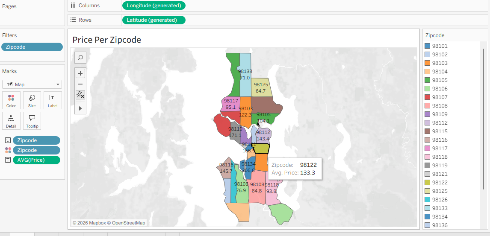
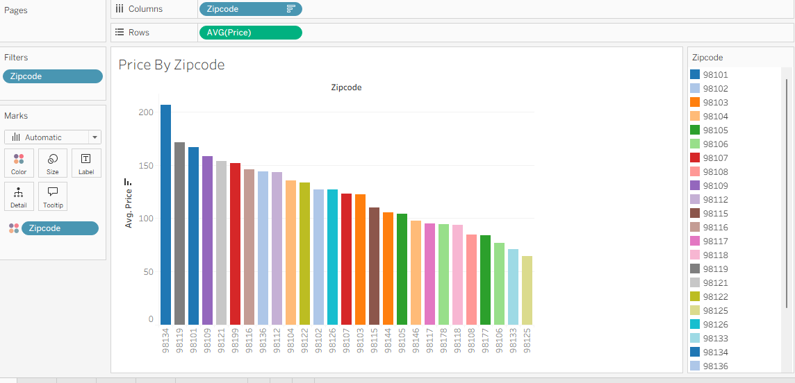
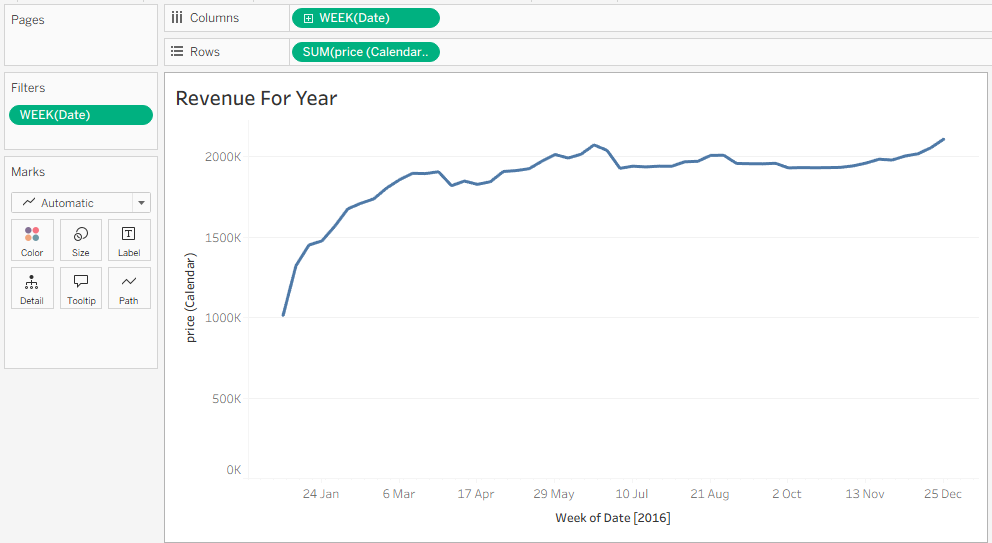

# 🏠 Airbnb Housing Analysis – Tableau Dashboard

## 📊 Project Overview
This project focuses on analyzing Airbnb housing data using **Tableau** to uncover pricing patterns, demand distribution, and revenue trends. The goal was to transform raw data into meaningful insights through interactive visualizations and data storytelling.

The final deliverable is a **single interactive dashboard** consisting of **five related visuals**, each highlighting a different aspect of the dataset.

---

## 🔍 Dashboard Visualizations & Insights

### 1. Average Price per Bedroom (Bar Chart)

This visualization shows how the average price increases with the number of bedrooms.
- 1-bedroom listings have an average price of **96.2**
- Prices gradually rise up to **584.8** for 6-bedroom houses  

**Insight:** Prices are directly affected by the increasing number of bedrooms.

---

### 2. Distinct Count of Listings by Bedroom Type

This chart highlights the availability and demand of listings by bedroom count.
- 1-bedroom listings dominate with **1,811 listings**
- 2-bedroom: **483**
- 3-bedroom: **206**
- 4-bedroom: **55**
- 5-bedroom: **20**

**Insight:** Smaller homes are more common and in higher demand compared to larger properties.

---

### 3. Price per Zipcode (Geographical Map)
A map-based visualization displaying average prices across different zip codes, helping identify pricing patterns geographically.

---

### 4. Price per Zipcode (Bar Chart)
The same pricing data is represented using a bar chart to allow easier comparison between zip codes.

---

### 5. Revenue Trend for 2016 (Line Chart)

This visualization displays weekly revenue trends for the year 2016:
- Revenue is lower at the start of the year
- Gradually increases towards the end of the year
- A noticeable rise around **June 2016**, likely due to summer vacations

**Insight:** Seasonal trends strongly influence Airbnb bookings.

---

## 🔗 Data Preparation
The dataset consists of two tables:
- **Listings** – contains details of Airbnb properties
- **Calendar** – contains booking and pricing information

An **inner join** was applied using:
- `id` from the Listings table
- `listing_id` from the Calendar table

This join enabled accurate analysis of pricing and revenue trends.

---

## 🛠 Tools & Technologies
- Tableau  
- Data Joining & Aggregation  
- Interactive Dashboard Design  
- Data Visualization & Storytelling  

---

## 🚀 Key Learnings
- Hands-on experience with joining multiple datasets
- Improved dashboard design and layout skills
- Better understanding of pricing, demand, and seasonal trends in real-world data

---

## 🔗 Tableau Public Dashboard
You can explore the interactive dashboard on Tableau Public here:

👉 **Tableau Public Link:**  
https://public.tableau.com/views/AirBnBProject_17691909740920/Dashboard1?:language=en-US&publish=yes&:sid=&:redirect=auth&:display_count=n&:origin=viz_share_link
